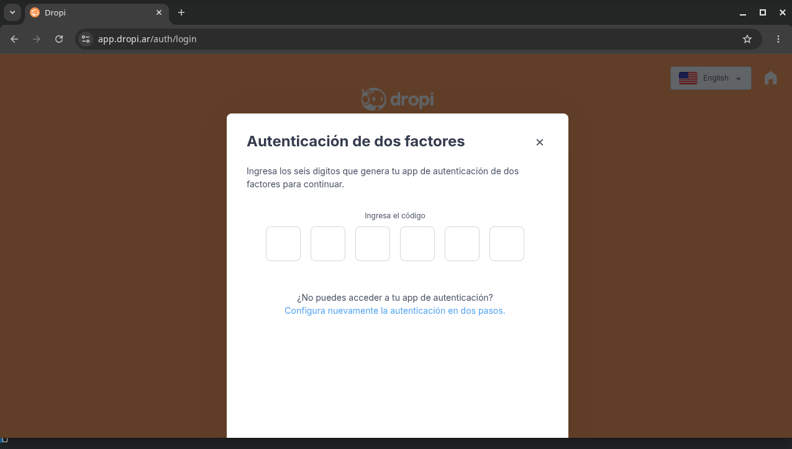
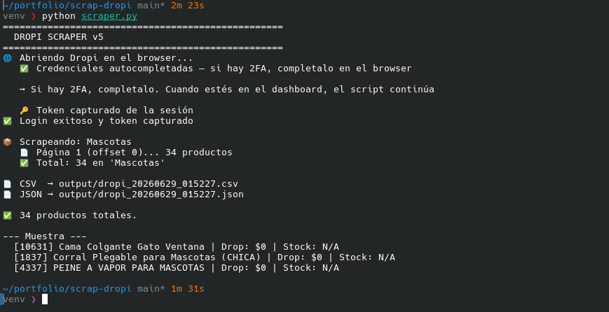
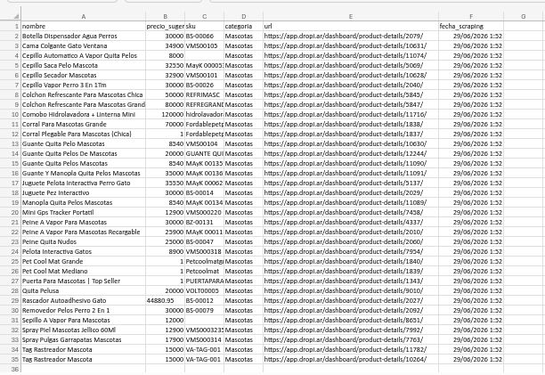

# Dropi Scraper 🐾

Dropi y plataformas similares cargan sus catálogos dinámicamente — no se pueden scrapear con `requests` simples. Esta herramienta resuelve eso: extrae precios, stock y SKU automáticamente y los exporta listos para analizar, evitando horas de carga manual de inventario.

Si sos un negocio que revende productos de Dropi, sabés lo tedioso que es copiar precio por precio a tu planilla. Acá tenés el catálogo completo en segundos.

## Capturas





## ¿Cómo funciona?

Dropi es una SPA (Single Page Application) — los datos no están en el HTML sino
que se cargan mediante llamadas a una API REST interna. El scraper:

1. Abre un browser (ventana visible para login manual con 2FA)
2. Autocompleta email y contraseña desde `.env` (si están configurados)
3. Captura el token `Bearer` interceptando las respuestas de la API
4. Navega cada categoría y fetchea productos via la API interna
5. Exporta todo a **CSV y JSON**

## Instalación

```bash
# 1. Crear entorno virtual (recomendado)
python -m venv venv
source venv/bin/activate        # Linux/Mac
venv\Scripts\activate           # Windows

# 2. Instalar dependencias
pip install -r requirements.txt

# 3. Instalar el browser de Playwright
playwright install chromium
```

## Configuración

Copiá `.env.example` a `.env` y completá tus credenciales:

```bash
cp .env.example .env
```

```
EMAIL=tu_email@ejemplo.com
PASSWORD=tu_password
```

> `.env` está en `.gitignore` — no se sube al repo.

Las categorías a scrapear se editan directo en `scraper.py`:

```python
CATEGORIAS = [
    "Mascotas",
    # "Electrónica",
    # "Hogar",
]
```

## Uso

```bash
python scraper.py
```

Los archivos se guardan en la carpeta `output/`:
- `dropi_YYYYMMDD_HHMMSS.csv`
- `dropi_YYYYMMDD_HHMMSS.json`

## Estructura del CSV

| Campo | Descripción |
|---|---|
| id | ID interno del producto en Dropi |
| nombre | Nombre del producto |
| precio_dropshipping | Precio dropshipping |
| precio_sugerido | Precio sugerido de venta |
| stock | Unidades disponibles |
| categoria | Categoría scrapeada |
| sku | SKU del producto |
| marca | Marca |
| url | Link directo al producto |
| fecha_scraping | Timestamp del scraping |

### Ejemplo real (output/dropi_20260614_235254.csv)

```csv
id,nombre,precio_dropshipping,precio_sugerido,stock,categoria,sku,marca,url,fecha_scraping
11074,Cepillo Automatico A Vapor Quita Pelos,0,8000,N/A,Mascotas,,,https://app.dropi.ar/dashboard/product-details/11074/,2026-06-14 23:52:53
11090,Guante Quita Pelos Mascotas,0,8540,N/A,Mascotas,MAyK 00135,,https://app.dropi.ar/dashboard/product-details/11090/,2026-06-14 23:52:53
11089,Manopla Quita Pelos Mascotas,0,8540,N/A,Mascotas,MAyK 00134,,https://app.dropi.ar/dashboard/product-details/11089/,2026-06-14 23:52:53
1837,Corral Plegable para Mascotas (CHICA),0,1,N/A,Mascotas,Fordablepetplayten,,https://app.dropi.ar/dashboard/product-details/1837/,2026-06-14 23:52:53
```

## Presentación del catálogo

Para obtener un CSV limpio listo para compartir (ordenado alfabéticamente, sin columnas vacías):

```bash
python clean_csv.py
```

Toma el último CSV generado y produce `output/dropi_*_clean.csv` con solo las columnas útiles: nombre, precio sugerido, SKU, categoría, URL y fecha.

## Tips

- **Sin headless**: El browser se abre visible (`headless=False`) para resolver 2FA manualmente
- **Velocidad**: Ajustá los `asyncio.sleep()` si querés ir más rápido (con cuidado de no ser bloqueado)
- **Múltiples categorías**: Agregá todas las que necesites en `CATEGORIAS`
